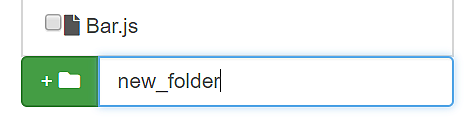

## A Guide to Using the Dashboard

### I. Navigating the Dashboard
The navigation bar is located to the left of every page. Clicking on any link from the navigation bar will redirect you to a new view.
> 

> *Figure 1: Navigation bar*

Currently, users can navigate to the following views:
1. [Home](#home)
2. [Schedule](#schedule)
3. [Applications](#applications)
4. [Files](#files)

### II. Dashboard Views

#### <a id="home"></a>1. Home
> The ```Home view``` provides detailed information about live devices ( running ```code engine``` instances) on the system, along with the programs these devices may be executing.

##### 1.1 List of Devices
Running devices can be seen from the ```Devices``` panel, along with the device's status.
> 

> *Figure 2: List of devices*

Clicking on a specific device will give users the option to view details about the device on the bottom or top pane located to the right of the page.
> 

> *Figure 3: Selecting a device to view on the pane*

##### 1.2 Detailed Device Pane
Users can view information for a specific device on the top or bottom ```Device Pane```. This information includes output to ```console```, graphs of the device's resource usage, and general information about the device. 
> 

> *Figure 4: Detailed device pane*

###### 1.2.1 Running Code on a Device
To run code on a device, have the device selected in the ```Device Pane```. Then, choose the code you want to execute on the device before clicking ```run```. You may only select code in the ```\codes\``` directory at this time.
> 

> *Figure 5: Running code on a device*

Once the code successfully launches on the device, you can  ```kill```,  ```pause```, or  ```migrate``` the process.
>

> *Figure 6: Additional options for running code*

#### <a id="schedule"></a>2. Schedule
> The ```Schedule view``` provides a time-based overview of events in the system. 

##### 2.1 The Time-Based Schedule View
The graph shown on the page provides users a time-based view of the events in the system. Users can minimize and maximize the graph, click on a specific point in time on the graph, or navigate forward or backwards in time. 
> 

> *Figure 7: A graph of events in the system*

##### 2.2 Events 
The events displayed on the graph can be further broken down into separate categories: ```Scheduler```, ```Engines```, ```Programs```. 
Note that the scheduler must be live for their events to be shown on the separate tabs. 

To see the phases of the scheduler, select the ```Scheduler``` tab
> 

> *Figure 8a: Scheduling phases*

To see device events, select the ```Engines``` tab
> 

> *Figure 8b: Device events*

To see program events, select the ```Programs``` tab
> 

> *Figure 8c: Program events*

#### <a id="applications"></a>3. Applications
> The ```Applications view``` allows users to define and save their own ```ThingsJS applications```

##### 3.1 Creating a New Application
A form is provided on this page to create a new application. The steps for creating an application are as follows:

1. Provide a name for your application

2. Browse through the filesystem and select components (code) to include in the application
	> 
	
    > *Figure 9: Selecting components for an application*
	
3. For each component, specify the number of instances of that component, and the component requirements (e.g. required memory)
	> 
	
    > *Figure 10: Component requirements*
	
4. Click  when you are finished


##### 3.2 Existing Applications
Users can view existing applications on a dropdown list at the bottom of the page under ```Existing Applications```. 
Clicking on an application in the list will expand the panel with information about the application
> 
> *Figure 11: Details for an existing application*

#### <a id="files"></a>4. Files 
> The ```Files view``` provides an interface to the ```ThingsJS filesystem```. 

##### 4.1 Filesystem Navigation 
Users can navigate the filesystem using the ```Filesystem Navigator```, which can be found to the right of the page. Files are indicated by a file icon, while directories are indicated by a folder icon.
> 

> *Figure 12: Filesystem navigator*

 Clicking on a file will bring the file up on the text editor to the left of the page. Clicking on a directory will bring the user inside the folder.

###### 4.1.1 Current Directory
Users can view the current directory at the top of the page. Any files or folders created will be made to the current directory.
> 

> *Figure 13: The current directory*

##### 4.2 Creating a New Directory
To create a new directory, type the directory name in the input field of the ```Filesystem Navigator```. Then, click the green button beside the input field when complete.
> 

> *Figure 14: Creating a new folder*

##### 4.3 Creating and Saving Files
To create a new file, click the ```Create New``` button located to the top-right of the page. This will clear any existing content in the text-editor. Afterwards,
1. Provide a name for your file

2. Fill the content of your file by writing inside the text editor
	> 

	> *Figure 15: Writing a file*

3. When complete, click the ```save``` button located at the bottom of the page
	> 

	> *Figure 16: Saving a file*

Your new file will be made visible in the ```Filesystem navigator``` once it has been successfully saved.

##### 4.4 Deleting Files and Folders
Delete files and folders by selecting them through the ```Filesystem navigator```. When complete, click the ```Delete selected``` button. They will disappear from the navigator once successfully deleted.
> 

> *Figure 17: Deleting files and folders*
